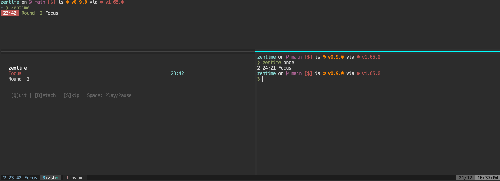

[](https://github.com/on3iro/zentime-rs/actions/workflows/release.yaml)
[](https://crates.io/crates/zentime-rs)
[](https://docs.rs/zentime-rs/latest/zentime_rs/)


# TOC

- [TOC](#toc)
    - [Features](#features)
        - [Example with multiple clients + display inside the left status bar of tmux](#example-with-multiple-clients--display-inside-the-left-status-bar-of-tmux)
    - [Installation](#installation)
        - [Homebrew](#homebrew)
        - [Cargo](#cargo)
        - [Nix](#nix)
    - [Configuration](#configuration)
    - [Tmux integration example](#tmux-integration-example)

A simple terminal based pomodoro/productivity timer written in Rust.

## Features

* Timer suited for the pomodoro technique
* Socket-based Client/Server-Architecture, where multiple clients can attach to a single timer server
* Server is terminal independent and runs as a daemon
* TUI-interface with keymaps + and a minimal TUI-interface
* CLI commands to interact with the timer without attaching a client (e.g. for integration into tools such as tmux)

### Example with multiple clients + display inside the left status bar of tmux



## Installation

> NOTE: The timer has currently only been tested on Mac and Linux, but might also work on Windows (please let me know if you tried it succesfully).

### Homebrew

```
brew tap install on3iro/zentime
brew install zentime
```

### Cargo

```
cargo install zentime-rs
```

### Nix

> Coming soon

## Configuration

The default location for the configuration file is `/home/<user>/.config/zentime/zentime.toml`.
To get an overview of available configuration options please have a look at the [example configuration](./zentime.example.toml).

For an overview of all available configuration keys, check out the [docs](https://docs.rs/zentime-rs/latest/zentime_rs/config/struct.Config.html).
Note that each key (`view`, `timers` etc.) corresponds to the header of a [toml table](https://toml.io/en/v1.0.0#table) while
clicking on the type inside the docs shows you the available configuration fields.

## Logs

Logs are being written to:

* `/tmp/zentime.d.err` - this captures any panics
* `/tmp/zentime.d.out` - this captures error/warn/info etc. logs

The default log level is `warn`.
You can configure the log level by running zentime with `RUST_LOG=<level> zentime`.
Here's an overview of [available log levels](https://docs.rs/log/0.4.17/log/enum.Level.html).

## Tmux integration example

To display the current timer state inside the tmux status bar you could use `zentime once` which will be queried by tmux on each status bar update.
Simply add the following snippet to your `.tmux.conf`:

```conf
set -g status-left " #(zentime once) "
```

If you would like to add shortcuts (e.g. to toggle pause/play) from inside tmux you could add bindings like this:

```conf
bind t run-shell "zentime toggle-timer > /dev/null"
bind y run-shell "zentime skip > /dev/null"
```
